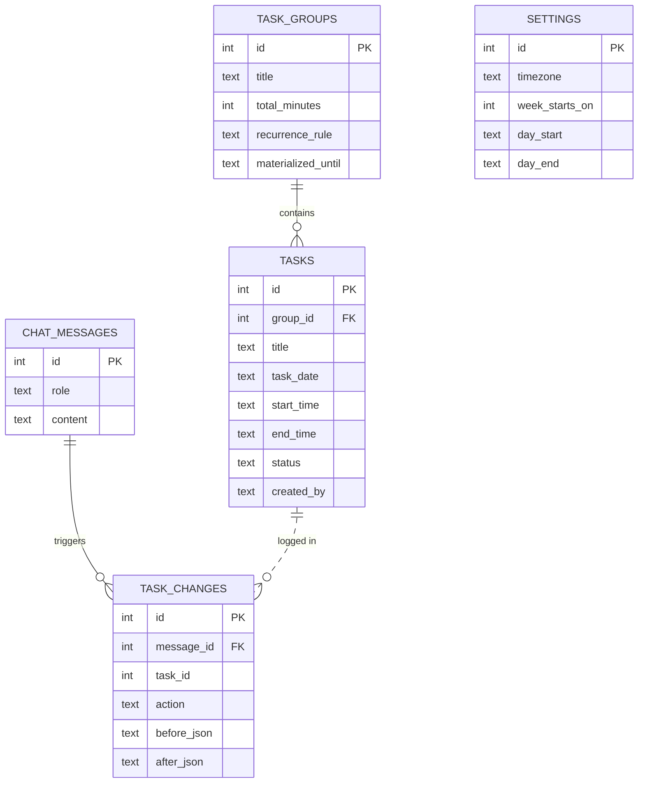

# xWeek

**A personal, AI-powered week planner you talk to in plain language.**

Tell xWeek what you need to do, and it adds, changes, or removes tasks in your calendar for you. Give it a big task and it can decide whether to split it into smaller ones and schedule them across your week. You can also ask it questions about your schedule.

> "I need to study 20h in 5 days" → xWeek creates five 4-hour study blocks.

---

## Table of Contents

- [Features](#features)
- [Examples](#examples)
- [How It Works](#how-it-works)
- [Data Model](#data-model)
- [Tech Stack](#tech-stack)
- [Getting Started](#getting-started)
- [Scripts](#scripts)
- [Deployment](#deployment)

---

## Features

- **Natural-language planning.** Describe your week the way you would to an assistant.
- **Full task control.** The AI can add, modify, and remove tasks in the database.
- **Smart task breakdown.** Large tasks are split into smaller ones and spread across days, only when it makes sense.
- **Schedule-aware answers.** Ask about free time or feasibility; xWeek reads your current tasks before answering.
- **Sensible defaults.** Vague requests (e.g. "a meeting with Josh") get placed in a fitting free slot.
- **Web GUI.** View your calendar and add, edit, or delete tasks manually, no chat required.
- **Bring your own model.** Works with any OpenAI-compatible API.

## Examples

| You say | What xWeek does |
| --- | --- |
| "I go to gym everyday from 19:00 to 21:00" | Adds a recurring *Gym* task every day, 19:00–21:00. |
| "I need to study 20h in 5 days" | Splits the work into a 4h study task on each of 5 days. |
| "I need to make a meeting with Josh" | Reasons that meetings suit mornings, checks your week, and books Monday at 10:00. |
| "How much free time do I have per day?" | Reads your tasks and answers, e.g. "about 4h free a day". No changes made. |
| "Do you think I can afford a new part-time job?" | Reads your tasks, weighs the job's hours against your free time, and answers, e.g. "No, not if it takes 5h a day". No changes made. |

Some requests change your plan (adding, modifying, removing tasks) and some are just questions. xWeek decides which is which.

## How It Works

1. You type a request in the web GUI.
2. The backend sends your request, along with your current tasks, to an OpenAI-compatible API.
3. The model decides what to do: add, modify, or remove tasks, break a large task into pieces, or simply answer.
4. The backend applies any changes to the database.
5. The GUI refreshes and shows your updated calendar, along with xWeek's reply.

## Data Model

The full schema lives in [`schema.sql`](schema.sql). There are no Month, Week or Day tables: the calendar views are built by querying tasks by date, so there is nothing to keep in sync.



| Table | Purpose |
| --- | --- |
| `tasks` | One block of time on one day. This is what the calendar shows. |
| `task_groups` | The intent behind one or more tasks, e.g. "study 20h" (split into several tasks) or "gym every day" (a recurring task). Lets you edit or delete a whole plan at once. |
| `settings` | Timezone, first day of the week, and waking hours. Waking hours are used to work out free time. |
| `chat_messages` | Conversation history, used as context for the AI and shown in the GUI. |
| `task_changes` | A log of every task the AI creates, updates or deletes, with before and after values. Makes changes reviewable and reversible. |

Dates are stored as `YYYY-MM-DD` and times as `HH:MM` in the user's local time, so "gym at 19:00" stays at 19:00 across daylight-saving changes.

### How the examples map to data

| You say | Stored as |
| --- | --- |
| "I go to gym everyday from 19:00 to 21:00" | One `task_groups` row with `recurrence_rule = 'FREQ=DAILY'`, plus a `tasks` row per day up to `materialized_until`. |
| "I need to study 20h in 5 days" | One `task_groups` row with `total_minutes = 1200`, plus five 4-hour `tasks` rows. |
| "I need to make a meeting with Josh" | A single `tasks` row with no group. |
| "How much free time do I have per day?" | No writes. Busy time per day is summed from `tasks` and subtracted from the waking hours in `settings`. |

## Tech Stack

| Layer | Technology |
| --- | --- |
| Backend | TypeScript, Express |
| Frontend | React |
| Database | SQLite (schema in [`schema.sql`](schema.sql)) |
| AI | Any OpenAI-compatible API |

## Getting Started

### Prerequisites

- Node.js and npm
- An API key and endpoint for an OpenAI-compatible provider

### Install

```bash
git clone <your-repo-url>
cd xweek
npm install
```

### Configure

<!-- TODO: replace with the real variable names your project reads -->

Set your API credentials before starting the app, for example in a `.env` file:

```env
OPENAI_API_KEY=your-key-here
OPENAI_BASE_URL=https://api.openai.com/v1
OPENAI_MODEL=your-model-name
```

Change the base URL to point at any other OpenAI-compatible provider.

### Run

```bash
npm run dev
```

Then open the URL printed in your terminal.

## Scripts

| Command | Description |
| --- | --- |
| `npm run dev` | Starts a development server that reloads instantly when files change. |
| `npm run build` | Exports the project to an `out` directory, ready to be served with nginx. |

## Deployment

Run `npm run build` and serve the generated `out` directory with nginx (or any static file server).
