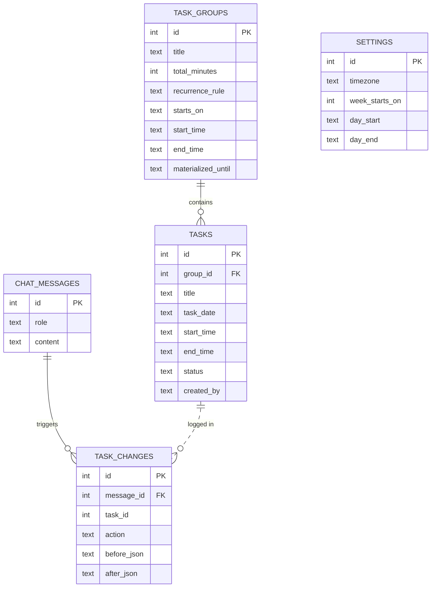

# xWeek

**A personal, AI-powered week planner you talk to in plain language.**

Tell xWeek what you need to do, and it adds, changes, or removes tasks in your calendar for you. Give it a big task and it can decide whether to split it into smaller ones and schedule them across your week. You can also ask it questions about your schedule.

> "I need to study 20h in 5 days" → xWeek creates five 4-hour study blocks.

---
# Screenshots


---

## Table of Contents

- [Features](#features)
- [Examples](#examples)
- [How It Works](#how-it-works)
- [Data Model](#data-model)
- [Tech Stack](#tech-stack)
- [Getting Started](#getting-started)
- [Scripts](#scripts)
- [Deployment](#deployment)

---

## Features

- **Natural-language planning.** Describe your week the way you would to an assistant.
- **Full task control.** The AI can add, modify, and remove tasks in the database.
- **Smart task breakdown.** Large tasks are split into smaller ones and spread across days, only when it makes sense.
- **Local datetime tools.** Temporal Cortex helps the assistant resolve relative dates, convert timezones, calculate durations, and adjust timestamps. Planning instructions require checking xWeek availability before scheduling.
- **Schedule-aware answers.** Ask about free time or feasibility; xWeek reads your current tasks before answering.
- **Sensible defaults.** Vague requests (e.g. "a meeting with Josh") get placed in a fitting free slot.
- **Web GUI.** View your week or month in a Persian or Gregorian calendar, and add, edit, or delete tasks manually. AI replies render common Markdown; start a new chat to clear conversation history without removing tasks.
- **Clear your schedule.** The Danger zone at the bottom deletes all local tasks and recurring schedules after confirmation. Google Calendar stays connected, and its events can be imported again.
- **Manual Google Calendar sync.** Connect your primary calendar, then import or export the displayed dates using the buttons or ask the assistant to sync a date range.
- **Bring your own model.** Works with any OpenAI-compatible API.

## Examples

| You say | What xWeek does |
| --- | --- |
| "I go to gym everyday from 19:00 to 21:00" | Adds a recurring *Gym* task every day, 19:00–21:00. |
| "I need to study 20h in 5 days" | Splits the work into a 4h study task on each of 5 days. |
| "I need to make a meeting with Josh" | Reasons that meetings suit mornings, checks your week, and books Monday at 10:00. |
| "How much free time do I have per day?" | Reads your tasks and answers, e.g. "about 4h free a day". No changes made. |
| "Do you think I can afford a new part-time job?" | Reads your tasks, weighs the job's hours against your free time, and answers, e.g. "No, not if it takes 5h a day". No changes made. |

Some requests change your plan (adding, modifying, removing tasks) and some are just questions. xWeek decides which is which.

## How It Works

1. You type a request in the web GUI.
2. The backend sends your request, along with your current tasks, to an OpenAI-compatible API.
3. The model decides what to do: add, modify, or remove tasks, break a large task into pieces, or simply answer.
4. The backend applies any changes to the database.
5. The GUI refreshes and shows your updated calendar, along with xWeek's reply.

## Data Model

The full schema lives in [`schema.sql`](schema.sql). There are no Month, Week or Day tables: the calendar views are built by querying tasks by date, so there is nothing to keep in sync.


```mermaid
erDiagram
    TASK_GROUPS ||--o{ TASKS : contains
    CHAT_MESSAGES ||--o{ TASK_CHANGES : triggers
    TASKS ||..o{ TASK_CHANGES : "logged in"

    TASK_GROUPS {
        int id PK
        text title
        int total_minutes
        text recurrence_rule
        text starts_on
        text start_time
        text end_time
        text materialized_until
    }
    TASKS {
        int id PK
        int group_id FK
        text title
        text task_date
        text start_time
        text end_time
        text status
        text created_by
    }
    CHAT_MESSAGES {
        int id PK
        text role
        text content
    }
    TASK_CHANGES {
        int id PK
        int message_id FK
        int task_id
        text action
        text before_json
        text after_json
    }
    SETTINGS {
        int id PK
        text timezone
        int week_starts_on
        text day_start
        text day_end
    }
```

| Table | Purpose |
| --- | --- |
| `tasks` | One block of time on one day. This is what the calendar shows. |
| `task_groups` | The intent behind one or more tasks, e.g. "study 20h" (split into several tasks) or "gym every day" (a recurring task). Lets you edit or delete a whole plan at once. |
| `settings` | Timezone, first day of the week, and waking hours. Waking hours are used to work out free time. |
| `chat_messages` | Conversation history, used as context for the AI and shown in the GUI. |
| `task_changes` | A log of every task the AI creates, updates or deletes, with before and after values. Makes changes reviewable and reversible. |

Dates are stored as `YYYY-MM-DD` and times as `HH:MM` in the user's local time, so "gym at 19:00" stays at 19:00 across daylight-saving changes.

### How the examples map to data

| You say | Stored as |
| --- | --- |
| "I go to gym everyday from 19:00 to 21:00" | One `task_groups` row with `recurrence_rule = 'FREQ=DAILY'`, `starts_on` and template times, plus a `tasks` row per day up to `materialized_until`. |
| "I need to study 20h in 5 days" | One `task_groups` row with `total_minutes = 1200`, plus five 4-hour `tasks` rows. |
| "I need to make a meeting with Josh" | A single `tasks` row with no group. |
| "How much free time do I have per day?" | No writes. Busy time per day is summed from `tasks` and subtracted from the waking hours in `settings`. |

## Tech Stack

| Layer | Technology |
| --- | --- |
| Backend | TypeScript, Express |
| Frontend | React, TanStack Query, [Doran](https://github.com/amiralibg/Doran) for the Persian calendar |
| Database | SQLite (schema in [`schema.sql`](schema.sql)) |
| AI | Any OpenAI-compatible API |

## Getting Started

### Prerequisites

- Node.js and npm
- An API key and endpoint for an OpenAI-compatible provider

### Install

```bash
git clone <your-repo-url>
cd xweek
npm install
```

### Configure

Set your API credentials before starting the app, for example in a `.env` file:

```env
OPENAI_API_KEY=your-key-here
OPENAI_BASE_URL=https://api.openai.com/v1
OPENAI_MODEL=your-model-name
TZ=Asia/Tehran
```

Change the base URL to point at any other OpenAI-compatible provider.
`TZ` sets xWeek's calendar timezone on each server start, including existing databases. Omit it to keep the saved timezone. Existing tasks keep their stored local dates and times.
Chat requires `OPENAI_API_KEY`; the server listens on `127.0.0.1` by default. Do not expose it publicly without authentication.

### Local planning tools (optional)

The root `.mcp.json` configures a local Temporal Cortex process:

```json
{
  "mcpServers": {
    "temporal-cortex": {
      "command": "npx",
      "args": ["--no-install", "@temporal-cortex/cortex-mcp"]
    }
  }
}
```

`npm install` installs the MCP SDK and the platform-specific Cortex binary. When AI is configured, xWeek starts the process once, discovers its tools, and exposes these five to the assistant: `get_temporal_context`, `resolve_datetime`, `convert_timezone`, `compute_duration`, and `adjust_timestamp`. Calls run locally without calendar OAuth; the AI model still uses your configured provider. xWeek passes its saved timezone (set by `TZ` at startup) and week-start preference to Cortex, disables its telemetry, validates tool inputs, and closes the process when the server stops. The `--no-install` flag avoids downloading packages when launching the server.

The assistant follows a planning workflow: establish the date and deadline, resolve relative times, read xWeek's free windows, fit the requested duration, then create tasks. Datetime tools provide time calculations; availability comes from xWeek's own tasks. Google Calendar sync stays manual through the existing buttons and tools.

The integration reads only the `temporal-cortex` entry. Remove that entry or `.mcp.json` and restart to disable it. If startup fails, the server logs a warning and the assistant continues with its built-in task tools. Planning instructions live in `src/server/ai/prompts.ts`, adapted for xWeek from the [Temporal Cortex datetime workflow](https://github.com/temporal-cortex/skills/tree/main/skills/temporal-cortex-datetime). See [Temporal Cortex documentation](https://github.com/temporal-cortex/mcp) for the underlying tools.

### Google Calendar (optional)

Enable the [Google Calendar API](https://console.cloud.google.com/apis/library/calendar-json.googleapis.com) in a Google Cloud project, configure its OAuth consent screen (add your account as a test user if needed), and create an OAuth client with application type **Web application**. Register this exact authorized redirect URI for development:

```text
http://localhost:5173/api/google-calendar/callback
```

Set the credentials in `.env`, then restart xWeek:

```env
GOOGLE_CLIENT_ID=your-google-client-id
GOOGLE_CLIENT_SECRET=your-google-client-secret
GOOGLE_REDIRECT_URI=http://localhost:5173/api/google-calendar/callback
```

For deployment, use the public frontend URL with `/api/google-calendar/callback` and register that exact URL in Google. Open xWeek on the same origin as the redirect URI. Click **Connect Google Calendar**, grant access, then use **Google Calendar → xWeek** or **xWeek → Google Calendar**. Both buttons sync only the displayed dates, up to 367 days per request. The assistant also has `sync_from_google_calendar` and `sync_to_google_calendar` tools with `from` and `to` dates; it syncs only when asked. Exports queued by the assistant execute after its reply is ready, and append the actual sync result. Local edits remain saved if an export fails; retrying does not create duplicates.

The selected direction wins for matching items. Recurring Google events import as individual tasks. All-day events occupy the configured waking hours. Events spanning multiple local days and events that conflict with existing tasks are skipped and reported. Deleting or cancelling items does not delete the other copy. A subsequent Google Calendar import recreates tasks deleted from xWeek if their Google events still exist. Disconnect removes the stored refresh token; links remain so reconnecting the same calendar preserves matching. You can revoke Google's authorization in your Google account settings. Tokens stay on the server in SQLite; protect the database file and backups.

The implementation follows Google's [web server OAuth flow](https://developers.google.com/identity/protocols/oauth2/web-server) and [Calendar events API](https://developers.google.com/workspace/calendar/api/v3/reference/events).

### Run

```bash
npm run dev
```

Then open the Vite URL printed in your terminal (normally `http://localhost:5173`). The Persian calendar is selected by default; use the toggle to switch to Gregorian.

## Scripts

| Command | Description |
| --- | --- |
| `npm run dev` | Starts the API and Vite development server with hot reload. |
| `npm run check:ai` | Checks the configured AI model's connection and function calling. |
| `npm run build` | Builds `out/client` and `out/server`, plus the schema and migrations. |
| `npm start` | Runs the built Node API server. |
| `npm test` | Runs the test suite. |

## Deployment

Run `npm run build` and `npm start` for the API. Serve `out/client` with nginx and proxy `/api` to the Node server; [`docs/nginx.conf`](docs/nginx.conf) is a local-only example. Configure authentication before exposing xWeek publicly.
